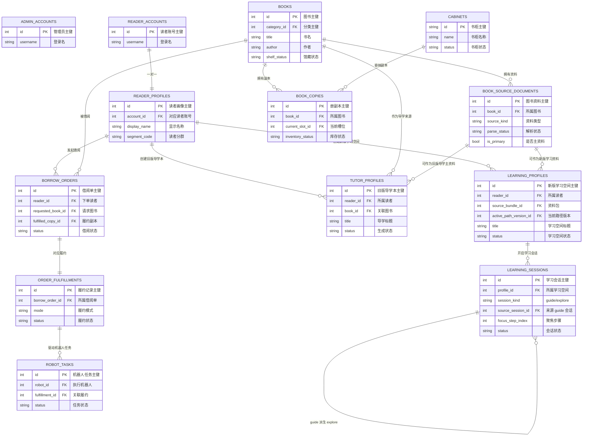
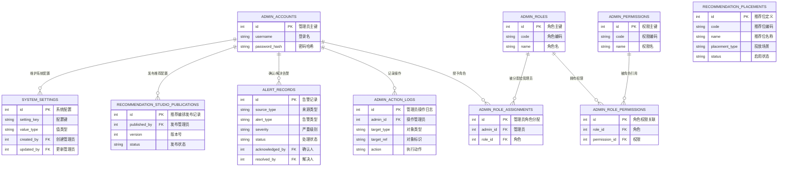
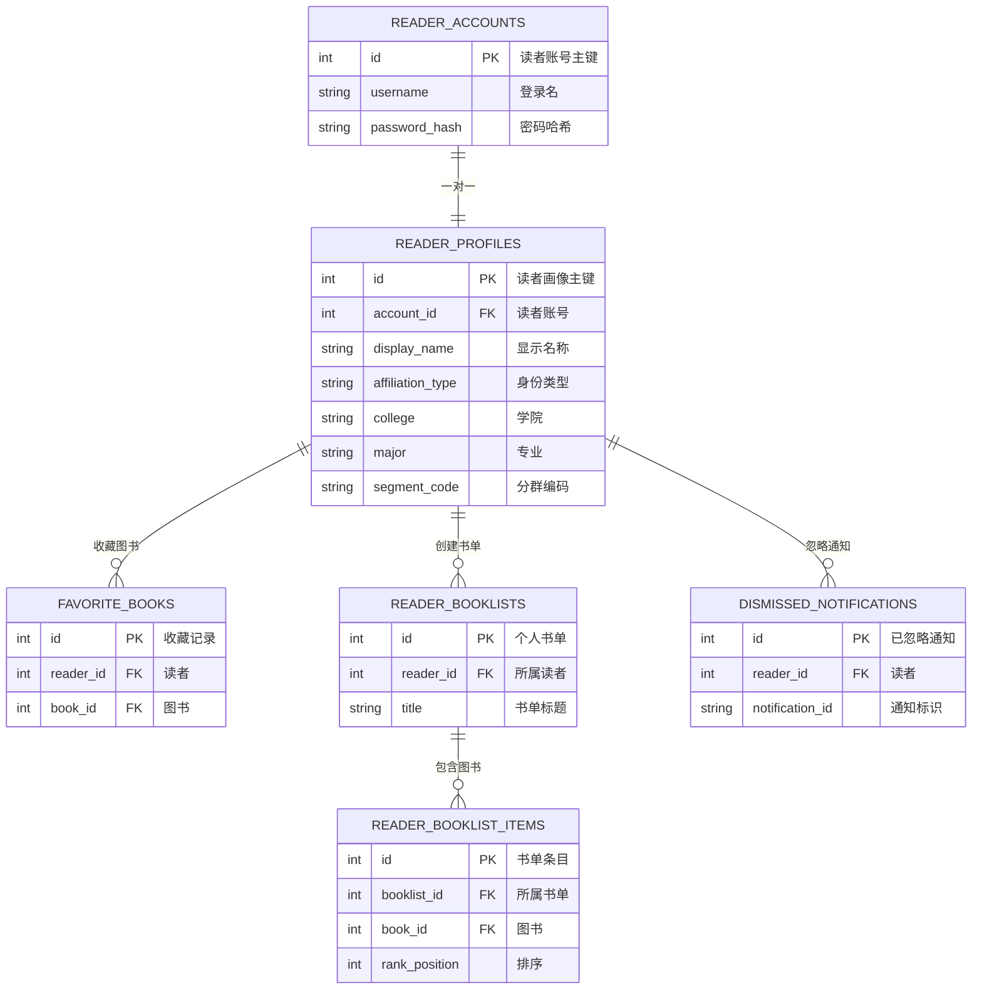
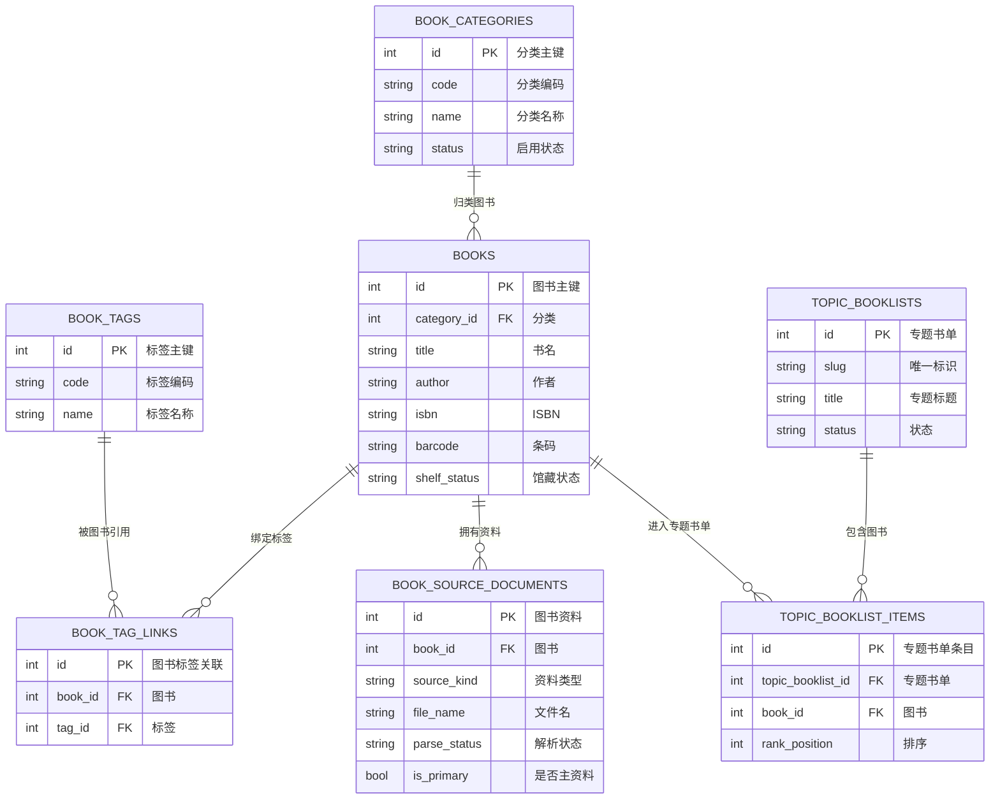
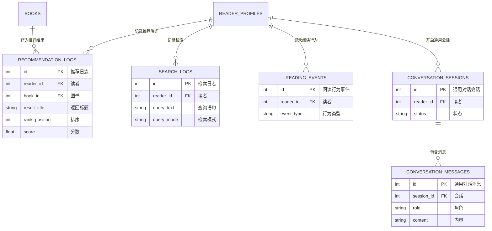
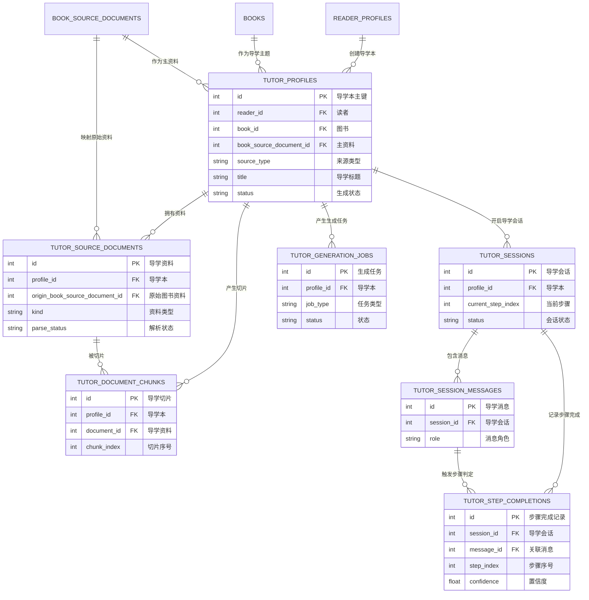
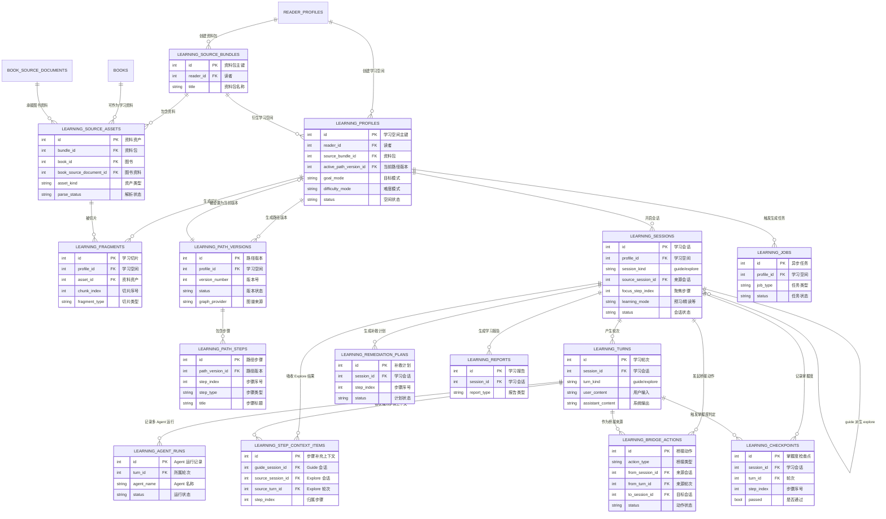

# Smart Bookshelf 数据库 ER 图

这份文档按模块整理当前 `service` 后端的数据库结构，覆盖目前在 `app/*/models.py` 中注册到 SQLAlchemy `Base` 的数据表，并补充迁移期需要理解的 legacy 结构。

说明：

- 为保证可读性，ER 图中保留了每张表的主键、主要外键和核心业务字段。
- 大部分表都还有 `created_at`、`updated_at` 一类审计字段，图中不再重复展开。
- `Tutor` 已在 `20260415_01` 迁移并退场，文档里保留其结构只用于说明历史数据如何迁入 `Learning`。
- `column_property`、部分 PostgreSQL 索引和检查约束未完全画入 ER 图，但在模型中仍然存在。

## 总览图



总览说明：

- `Reader / Book / Inventory / Order` 是业务主线。
- `Tutor` 和 `Learning` 共用 `Reader`、`Book`、`BookSourceDocument` 这些基础实体。
- `LearningSession` 已经支持 `Guide` 和 `Explore` 双模式，并能通过 `source_session_id` 实现桥接。

## 模块一：认证、后台与系统配置



中文注释：

- `admin_accounts`：后台管理员账号。
- `admin_action_logs`：后台操作审计，记录谁改了什么。
- `admin_roles / admin_permissions / admin_role_permissions / admin_role_assignments`：后台 RBAC 权限系统。
- `alert_records`：后台告警中心。
- `recommendation_placements / recommendation_studio_publications`：推荐位配置和发布快照。
- `system_settings`：全局系统设置表。

## 模块二：读者与个人化资产



中文注释：

- `reader_accounts`：读者登录账号。
- `reader_profiles`：读者画像，承载兴趣、专业、分群和个性化偏好。
- `favorite_books`：收藏夹。
- `reader_booklists / reader_booklist_items`：用户自建书单。
- `dismissed_notifications`：读者在 App 中手动隐藏的通知。

## 模块三：图书目录与资料层



中文注释：

- `book_categories`：标准分类。
- `book_tags / book_tag_links`：灵活标签体系。
- `books`：图书主数据，包含检索文本和向量字段。
- `book_source_documents`：图书关联的原始资料与解析产物，是导学/RAG 的基础数据入口。
- `topic_booklists / topic_booklist_items`：后台配置的专题书单。

## 模块四：库存、借阅、归还与机器人

```mermaid
erDiagram
    CABINETS {
        string id PK "书柜主键"
        string name "书柜名称"
        string location "位置"
        string status "状态"
    }

    CABINET_SLOTS {
        int id PK "槽位主键"
        string cabinet_id FK "所属书柜"
        string slot_code "槽位编号"
        string status "槽位状态"
    }

    BOOK_COPIES {
        int id PK "副本主键"
        int book_id FK "所属图书"
        int current_slot_id FK "当前槽位"
        string inventory_status "库存状态"
    }

    BOOK_STOCK {
        int id PK "库存汇总"
        int book_id FK "图书"
        string cabinet_id FK "书柜"
        int total_copies "总册数"
        int available_copies "可借册数"
        int reserved_copies "预留册数"
    }

    INVENTORY_EVENTS {
        int id PK "库存事件"
        string cabinet_id FK "书柜"
        int book_id FK "图书"
        int copy_id FK "副本"
        string event_type "事件类型"
    }

    BORROW_ORDERS {
        int id PK "借阅单"
        int reader_id FK "读者"
        int requested_book_id FK "请求图书"
        int fulfilled_copy_id FK "履约副本"
        string fulfillment_mode "履约模式"
        string status "借阅状态"
    }

    ORDER_FULFILLMENTS {
        int id PK "履约记录"
        int borrow_order_id FK "借阅单"
        string source_cabinet_id FK "源书柜"
        int source_slot_id FK "源槽位"
        string mode "履约模式"
        string status "履约状态"
    }

    RETURN_REQUESTS {
        int id PK "归还请求"
        int borrow_order_id FK "借阅单"
        int copy_id FK "归还副本"
        string receive_cabinet_id FK "回收书柜"
        int receive_slot_id FK "回收槽位"
        int processed_by_admin_id FK "处理管理员"
        string status "归还状态"
    }

    ROBOT_UNITS {
        int id PK "机器人"
        string code "机器人编码"
        string status "机器人状态"
    }

    ROBOT_TASKS {
        int id PK "机器人任务"
        int robot_id FK "机器人"
        int fulfillment_id FK "履约记录"
        int reassigned_from_task_id FK "前序任务"
        int superseded_by_task_id FK "后继任务"
        string status "任务状态"
    }

    ROBOT_STATUS_EVENTS {
        int id PK "机器人状态事件"
        int robot_id FK "机器人"
        int task_id FK "任务"
        string event_type "事件类型"
    }

    CABINETS ||--o{ CABINET_SLOTS : "包含槽位"
    CABINETS ||--o{ BOOK_STOCK : "汇总库存"
    CABINETS ||--o{ INVENTORY_EVENTS : "产生库存事件"
    CABINETS ||--o{ ORDER_FULFILLMENTS : "作为取书点"
    CABINETS ||--o{ RETURN_REQUESTS : "作为还书点"

    BOOKS ||--o{ BOOK_COPIES : "拆成副本"
    BOOKS ||--o{ BOOK_STOCK : "形成库存汇总"
    BOOKS ||--o{ INVENTORY_EVENTS : "参与库存事件"
    BOOKS ||--o{ BORROW_ORDERS : "被请求借阅"

    CABINET_SLOTS ||--o{ BOOK_COPIES : "存放副本"
    CABINET_SLOTS ||--o{ ORDER_FULFILLMENTS : "作为发货槽位"
    CABINET_SLOTS ||--o{ RETURN_REQUESTS : "作为回收槽位"

    READER_PROFILES ||--o{ BORROW_ORDERS : "发起借阅"
    BOOK_COPIES ||--o{ BORROW_ORDERS : "履约借阅单"
    BORROW_ORDERS ||--|| ORDER_FULFILLMENTS : "唯一履约"
    BORROW_ORDERS ||--o| RETURN_REQUESTS : "发起归还"

    ADMIN_ACCOUNTS ||--o{ RETURN_REQUESTS : "处理归还"
    ROBOT_UNITS ||--o{ ROBOT_TASKS : "执行任务"
    ORDER_FULFILLMENTS ||--o{ ROBOT_TASKS : "触发机器人任务"
    ROBOT_TASKS ||--o{ ROBOT_STATUS_EVENTS : "产生状态事件"
```



中文注释：

- `cabinets / cabinet_slots`：智能书柜及其槽位。
- `book_copies / book_stock / inventory_events`：副本、库存汇总、库存流水。
- `borrow_orders / order_fulfillments / return_requests`：借阅、履约、归还主链路。
- `robot_units / robot_tasks / robot_status_events`：机器人配送模拟链路。

## 模块五：推荐、搜索、会话与行为分析



中文注释：

- `recommendation_logs`：推荐结果和解释日志。
- `search_logs`：图书检索日志。
- `reading_events`：阅读和使用行为事件。
- `conversation_sessions / conversation_messages`：通用问答/闲聊会话，不专属于导学。

## 模块六：旧版导学域 Tutor（已退场，仅迁移参考）



中文注释：

- `tutor_*` 是旧版导学实现，结构偏传统：资料入库、切片、会话、步骤完成。
- 当前线上主域已经切到 `learning_*`；这部分只保留为历史结构说明，便于理解迁移脚本和旧数据来源。

## 模块七：新版导学域 Learning V2



中文注释：

- `learning_source_bundles / learning_source_assets`：资料包与资料资产层，承接馆藏书、解析文档和外部材料。
- `learning_fragments`：新版 RAG 切片，支持向量和词法混合检索。
- `learning_path_versions / learning_path_steps`：把“导学路径”实体化，支持版本化。
- `learning_sessions / learning_turns`：统一承载 `Guide` 和 `Explore` 两种会话。
- `learning_step_context_items / learning_bridge_actions`：用于实现 Guide 和 Explore 之间的桥接。
- `learning_agent_runs / learning_checkpoints / learning_remediation_plans / learning_reports`：支撑多智能体导学、掌握度评估、补救和报告。
- `learning_jobs`：生成、解析、图谱构建等任务记录。

## 重点关系解读

### 1. 图书资料如何进入导学域

```text
books
  -> book_source_documents
  -> learning_source_assets
  -> learning_fragments
  -> learning_path_versions / learning_path_steps
  -> learning_sessions
```

含义：

- 图书和资料先在目录层登记。
- 导学域不是直接吃 `books`，而是通过 `book_source_documents` 和 `learning_source_assets` 把资料规范化。
- 只有经过 `fragments` 切片和 `path_versions` 规划后，才会进入真正的导学会话。

### 2. Guide / Explore / Bridge 的核心闭环

```text
guide session
  -> learning_turns (guide)
  -> learning_checkpoints / remediation / reports

guide session
  -> bridge action (expand_step_to_explore)
  -> explore session
  -> learning_turns (explore)
  -> bridge action (attach_explore_turn_to_guide_step)
  -> learning_step_context_items
  -> guide 检索优先召回
```

含义：

- `Guide` 负责步骤推进。
- `Explore` 负责自由问答。
- `Bridge` 不直接推进步骤，而是把自由探索的结果沉淀为后续 Guide 的高优先级证据。

### 3. 导学域收敛策略

```text
tutor_*    -> 已迁移并删除
learning_* -> 当前唯一导学主域
```

含义：

- `tutor_*` 已完成迁移后删除，不再承担真实业务。
- `learning_*` 现在是唯一导学主域，承载 `Guide / Explore / Bridge`。
- 迁移脚本和 Alembic 仅用于把遗留 tutor 数据搬入 learning。
