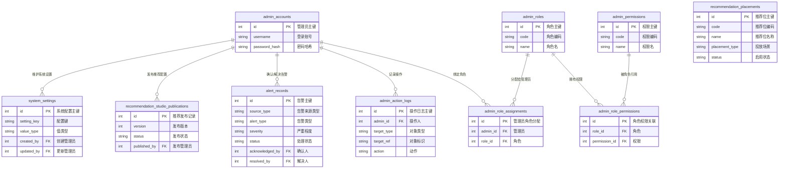
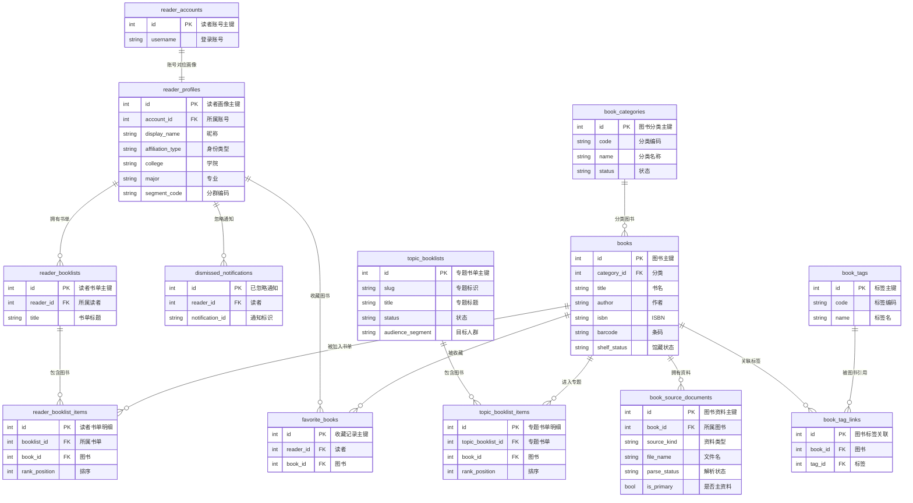
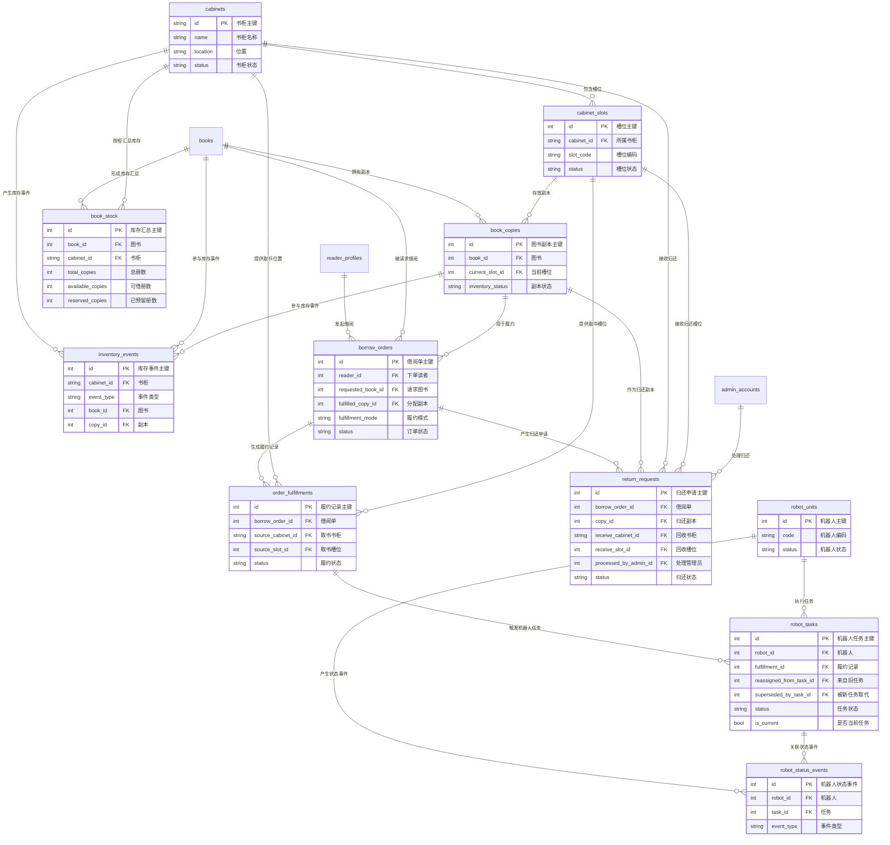
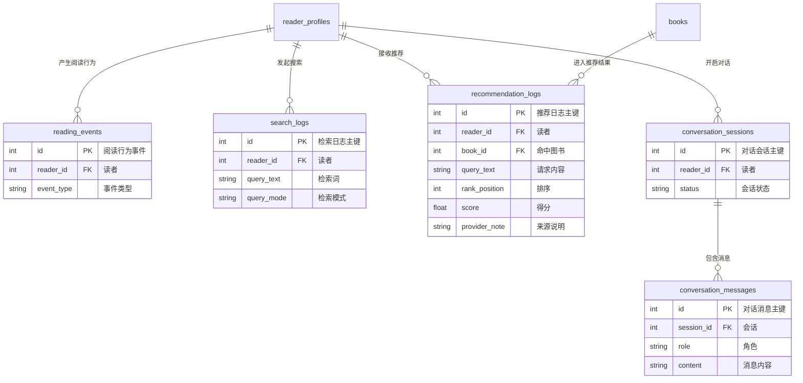
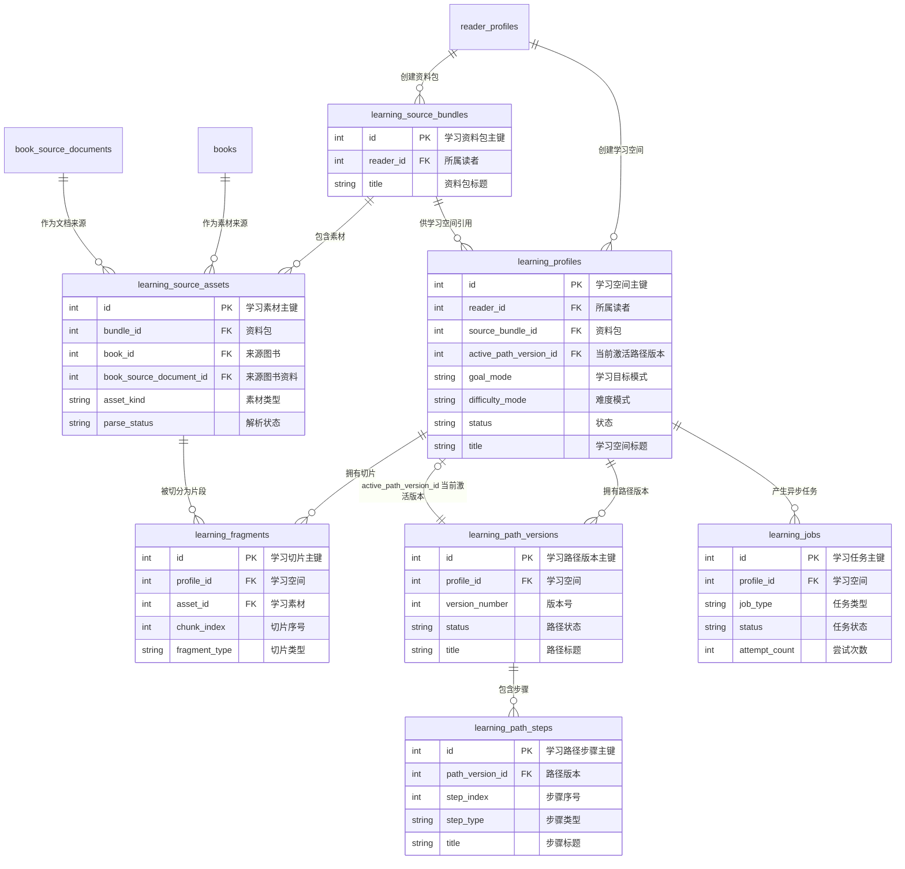
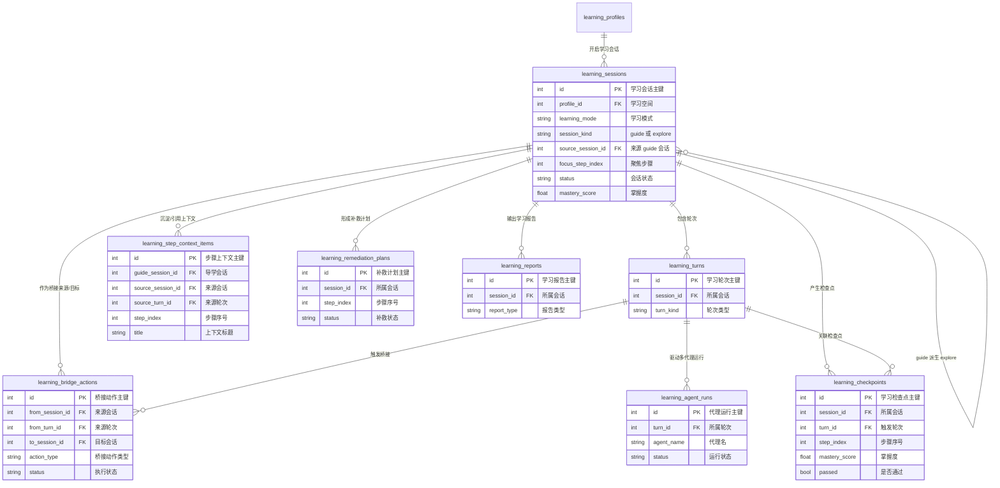

# Service Branch 数据库现状与 ER 图

更新时间：2026-04-15（Asia/Shanghai）

## 数据口径

本文分成两个口径：

- `service` 已提交 HEAD：`6b382f6412afb7e79d345693052b34538f8d8979`，提交时间 `2026-04-14 20:07:35 +0800`，共 `46` 张表，教学域仍使用 `tutor_*`。
- `service` 当前 worktree 最新态：本地存在未提交的迁移与模型变更，共 `54` 张活动表，教学域已切换为 `learning_*`，并准备退役 `tutor_*`。

当前 worktree 里与数据库直接相关的新增迁移：

- `alembic/versions/20260414_02_learning_v2_schema.py`
- `alembic/versions/20260415_01_retire_tutor_schema.py`

本文后续 ER 图默认以“当前 worktree 最新态”作为主口径，因为你问的是“目前最新的数据库”。

## 快速结论

- 当前最新活动表数量：`54`
- 相比 `service` HEAD，新增 `15` 张 `learning_*` 表
- 相比 `service` HEAD，退役 `7` 张 `tutor_*` 表
- 相比 `service` HEAD，净增 `8` 张表

教学域迁移关系：

- `tutor_profiles` -> `learning_source_bundles` + `learning_profiles` + `learning_path_versions`
- `tutor_source_documents` -> `learning_source_assets`
- `tutor_document_chunks` -> `learning_fragments`
- `tutor_sessions` / `tutor_session_messages` -> `learning_sessions` / `learning_turns`
- `tutor_step_completions` -> `learning_checkpoints`
- `tutor_generation_jobs` -> `learning_jobs`

## 模块分布

- 后台与系统：`admin_*`、`alert_records`、`system_settings`、`recommendation_placements`、`recommendation_studio_publications`
- 读者与书单：`reader_*`、`favorite_books`、`dismissed_notifications`、`topic_booklists*`
- 图书目录：`books`、`book_categories`、`book_tags`、`book_tag_links`、`book_source_documents`
- 库存与借阅：`cabinets`、`cabinet_slots`、`book_copies`、`book_stock`、`inventory_events`、`borrow_orders`、`order_fulfillments`、`return_requests`
- 机器人履约：`robot_units`、`robot_tasks`、`robot_status_events`
- 推荐、行为与会话：`recommendation_logs`、`reading_events`、`search_logs`、`conversation_sessions`、`conversation_messages`
- 学习域：`learning_*`

## 模块一：后台、权限与系统配置

说明：

- `admin_accounts` 是后台统一身份中心。
- `admin_roles` / `admin_permissions` / `admin_role_*` 是标准 RBAC 权限模型。
- `alert_records`、`system_settings`、推荐位配置都挂在管理员体系下。

## 模块二：读者、书单与图书目录

说明：

- `reader_accounts` 与 `reader_profiles` 是一对一，账号与画像分离。
- 图书目录主实体是 `books`，分类、标签、资料文档都围绕它展开。
- 书单分为读者自建书单 `reader_booklists` 与运营专题书单 `topic_booklists` 两套。

## 模块三：库存、借阅与机器人履约

说明：

- `book_copies` 是“单册实体”，`book_stock` 是“按书柜汇总的库存快照”。
- `borrow_orders` 是读者借阅主单，`order_fulfillments` 是履约过程，`robot_tasks` 是机器人执行层。
- `return_requests` 同时连接借阅单、册、副本回收点和管理员处理人。

## 模块四：推荐、行为分析与对话会话

说明：

- `reading_events`、`search_logs`、`recommendation_logs` 是行为分析与推荐效果评估的基础日志。
- `conversation_sessions` / `conversation_messages` 提供面向读者的自然语言会话上下文。

## 模块五：Learning 资料、路径与作业

说明：

- `learning_source_bundles` 是读者维度的学习资料容器。
- `learning_profiles` 是新版教学/学习主实体，代替旧 `tutor_profiles`。
- `learning_source_assets` 对接书籍与书籍资料，`learning_fragments` 存放切片、检索文本和向量。
- `learning_path_versions` / `learning_path_steps` 表示学习路径及其版本化步骤。

## 模块六：Learning 会话、桥接与评估

说明：

- `learning_sessions` 已经显式支持 `guide` 与 `explore` 两类会话，并用 `source_session_id` 做桥接。
- `learning_turns` 是学习对话轮次，`learning_agent_runs` 记录 teacher、peer 等代理运行。
- `learning_checkpoints`、`learning_remediation_plans`、`learning_reports` 共同组成评估闭环。

## Legacy：service HEAD 中仍存在、当前最新态准备退役的 Tutor 表

`service` 已提交 HEAD 里，以下 `7` 张表仍然存在：

- `tutor_profiles`
- `tutor_source_documents`
- `tutor_document_chunks`
- `tutor_sessions`
- `tutor_session_messages`
- `tutor_step_completions`
- `tutor_generation_jobs`

对应关系：

- `tutor_profiles`：旧版导学主实体，对应新版 `learning_profiles`
- `tutor_source_documents`：旧版导学资料，对应新版 `learning_source_assets`
- `tutor_document_chunks`：旧版向量切片，对应新版 `learning_fragments`
- `tutor_sessions` / `tutor_session_messages`：旧版导学对话，对应新版 `learning_sessions` / `learning_turns`
- `tutor_step_completions`：旧版步骤完成度，对应新版 `learning_checkpoints`
- `tutor_generation_jobs`：旧版导学生成任务，对应新版 `learning_jobs`

## 结论

- 如果你要看“`service` 分支已提交版本”的数据库，请以 `46` 张表、`tutor_*` 仍存在为准。
- 如果你要看“`service` 当前最新工作态”的数据库，请以 `54` 张活动表、`learning_*` 已接管教学域为准。
- 从业务主线看，数据库主干依旧是 `读者 -> 图书目录 -> 库存/借阅 -> 机器人履约`。
- 增量最大、变化最快的是教学域，也就是 `Tutor（旧） -> Learning（新）`。
